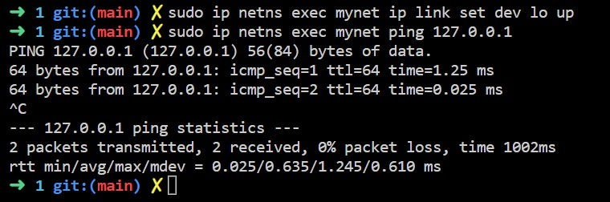

### Creating a jail

### Downloading an OCI image from docker and unpacking it to a useable filesystem

### Running a chrooted bash inside our new filesystem

### Mounting /proc and listing all running processes

### Mounting /sys and listing all networks

### Listing the namespaces of current process

### Using unshare to create namespaces to isolate our jail

### Trying hostname

### Trying pid isolation

### Trying network isolation

### Creating a new network in our isolated jail

### Trying to ping localhost

### Setting up my network and pinging again

### Creating another network to communicate with

### Displaying informations

### Setup

### Ping test

### Creating a new user namespace and performing a whoami

### Testing control groups

### Limiting memory, swappiness and processor usage

### Running a program that reaches the limit set earlier

### Running a forked bash with a new pid namespace and checking its isolation

### Entering the bash process namespaces by targetting its pid

### Using runc to launch a bash in our debian container
