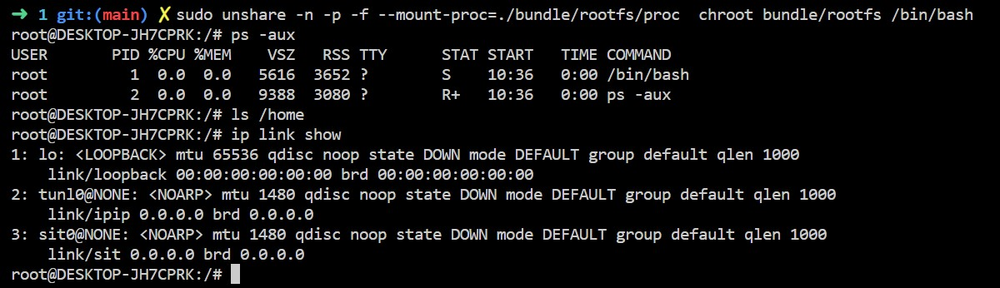

# Build Docker from the ground up

## Run a bash server in a jailed environment without using Docker

### Prerequisites
- An OCI image of Debian or CentOS pulled with skopeo:
	```
	skopeo copy docker://debian:10-slim oci:debian:10-slim
	```

- An functional filesystem unpacked with umoci:
	```
	umoci unpack --image debian:10-slim ./bundle
	```

- Installing the necessary packages to test that our container is truly isolated:
	```
	chroot bundle/rootfs /bin/bash
	# inside the jail
	# apt-get update -y
	# apt-get install -y procps net-tools iproute2
	# mount -t proc proc /proc
	```


### Objectives
- Cannot see host's network when typing:
	```
	ip link show
	```
- Cannot see host's network when typing:
	```
	ls /home
	```
- Cannot see host's network when typing:
	```
	ps aux
	```

### How to do it
Run the following command:
```
sudo unshare -n -p -f --mount-proc=$PWD/bundle/rootfs/proc  chroot bundle/rootfs /bin/bash
```

Let's take a look at this command to understand exactly what it does:

- unshare is used to create new namespaces and then executes the command specified as argument (chroot rootfs /bin/bash)
- -n flag creates a new network namespace
- -p flag creates a new PID namespace
- -f flag forks the specified command as a child process of unshare instead of simply running it
- --mount-proc flag mounts the proc file system to the path specified right before running the command, it also creates a new mount namespace.

Congratulations, you created your first isolated container without Docker !



## Ressources :

[unshare(1) man page](https://man7.org/linux/man-pages/man1/unshare.1.html)

[Linux namespaces](https://en.wikipedia.org/wiki/Linux_namespaces)

[containers from scratch](https://ericchiang.github.io/post/containers-from-scratch/)