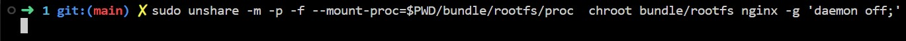
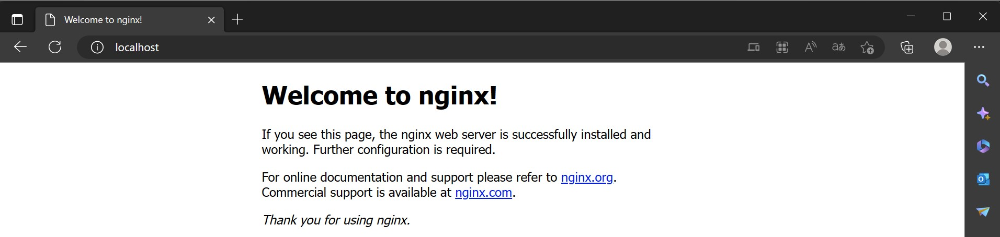

# Build Docker from the ground up 2

## Run an NGINX server in a jailed environment without using Docker, and host on it a page that is served to your host, accessible through your browser.

### Prerequisites
- An OCI image of Debian or CentOS pulled with skopeo:
	```
	skopeo copy docker://debian:10-slim oci:debian:10-slim
	```

- An functional filesystem unpacked with umoci:
	```
	umoci unpack --image debian:10-slim ./bundle
	```

- Installing the necessary packages for running ngninx and monitoring:
	```
	chroot bundle/rootfs /bin/bash
	# inside the jail
	# apt-get update -y
	# apt-get install -y procps net-tools iproute2 nginx
	# mount -t proc proc /proc
	```

### How to do it

Create the necessary devices in /dev:
```
/bin/mknod -m 0666 $D/dev/null c 1 3
/bin/mknod -m 0666 /dev/random c 1 8
/bin/mknod -m 0666 /dev/urandom c 1 9
/bin/chown root:root /dev/random /dev/urandom /dev/null
```

Run the following command:
```
sudo unshare -m -p -f --mount-proc=./bundle/rootfs/proc chroot bundle/rootfs nginx -g 'daemon off;'
```

Note that this time we stayed on the same network namespace as our host to allow communication.

Congratulations, you created your first nginx server container without Docker !


You can now go on your host browser and communicate with you server by going to localhost:80


We can also open a bash in the same namespaces as nginx using nsenter by targeting its pid:
```
sudo nsenter -r -t 2829 unshare -p -f chroot bundle/rootfs /bin/bash
```

## Ressources :

[unshare(1) man page](https://man7.org/linux/man-pages/man1/unshare.1.html)

[Linux namespaces](https://en.wikipedia.org/wiki/Linux_namespaces)

[containers from scratch](https://ericchiang.github.io/post/containers-from-scratch/)

[container namespaces with nsenter](https://www.redhat.com/sysadmin/container-namespaces-nsenter)

[running nginx in a chroot jail](https://www.cyberciti.biz/faq/howto-run-nginx-in-a-chroot-jail/)