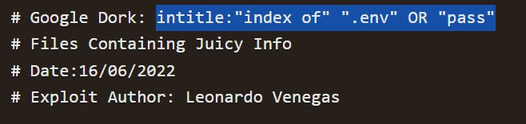
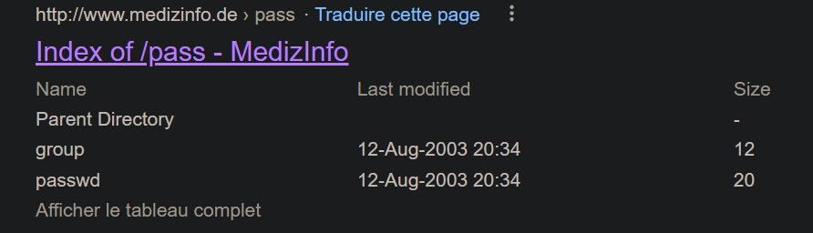
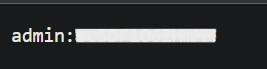
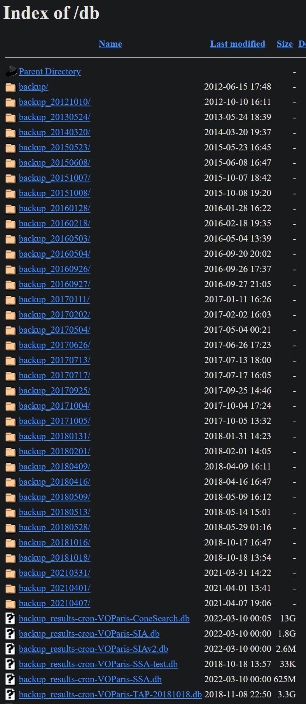

# What is Google Dorking?

Google Dorking is a technique of hacking wherein the hacker can make advanced searches through specific queries in the search service to identify valuable data on the surface web or content that is hard to find through regular search. Often hackers call this technique Google hacking since they use the Google search engine to do the hack. At the core of this technique the hacker uses explicit modifiers to search queries.

Users can also leverage specific commands like "filetype", "intext", & "site" for getting various detailed search results. Security experts and cybercriminals can use this dorking technique to obtain or extract information about any target system or unauthorized data to exploit security vulnerabilities in apps and websites.

## Testing it out

Let's try a simple dork:

We can browse google with the query to find vulnerable websites

For example on this website index we found some credentials for an admin account (censored)😅

On this one we found several database backups

