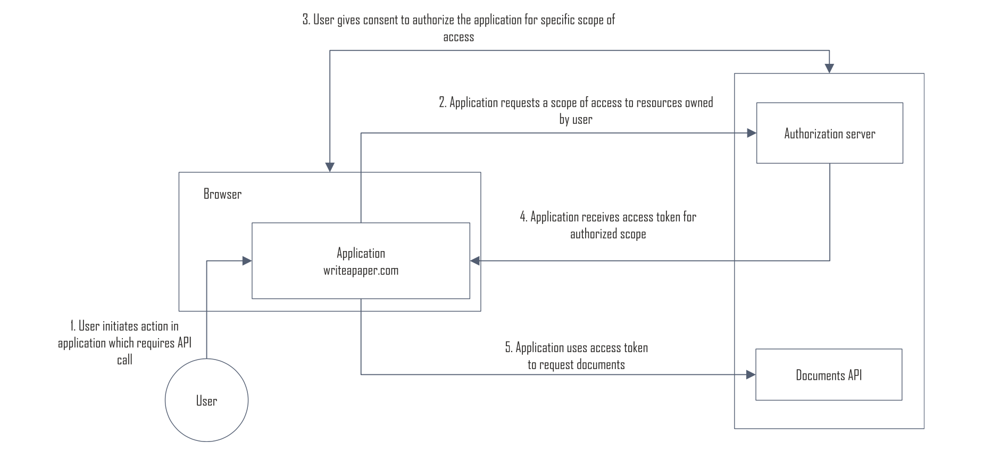
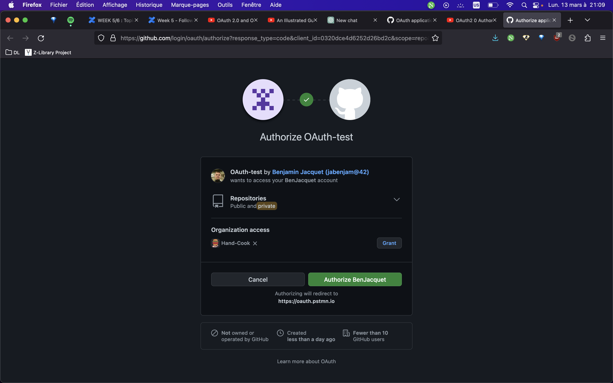
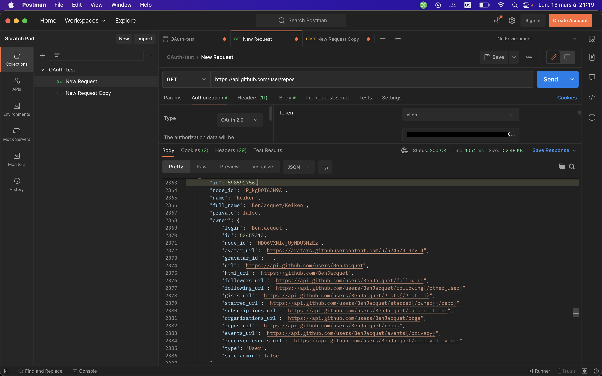

# Solving Identity Management in modern applications

## Introduction

### Design questions

First of all, before starting any project we must ask ourselves some very important questions:
- Who are your users?
- How will users log in? Is there an existing account available to them that they would like to reuse?
- Can your application be used anonymously or is authentication needed?
- What kind of delivery – Web or native – does your application intend to provide?
- Will your application need to call any APIs? If so, who owns the data that your application will retrieve?
- How sensitive is the data that your application handles?
- What access control requirements are needed?
- How long should a user’s session last?
- Is there more than one application in your system? If so, will users benefit from single sign-on? (Don’t forget a support forum!)
- What should happen when users log out?
- Are there any compliance requirements associated with this data (GDPR)?

<br/>

### Identity is supposed to protect you user, not drag them

Modern users expect a frictionless, well-designed experience when using an application.
Identity management should help them access an application quickly, not get in their way.

<br/>

### What is identity

The term “identity” is defined as a collection of attributes associated with a specific person or entity in a particular context. An identity includes one or more identifiers and may contain other attributes associated with a person or entity. Human identities may include attributes such as name, age, address, phone number, eye color, and job title. Nonhuman identities may include attributes such as an owner, IP address, and perhaps a model or version number. The attributes which make up an identity may be used for authentication and authorization as well as conveying information about the identity to applications.

<br/>

### The life of an identity


This figure shows us the different events in the life of an identity:

<b>Provisioning</b>

For example, a user named Alice wishes to use some online banking services. Alice might establish an online account at a bank by filling out an account registration form. Alice would provide identity information including a username, a password, her name, home address, phone number, email address, and some form of tax ID. This data would be used to provision an online account at the bank associated with Alice’s personal identity.


<b>Authorization</b>

When Alice creates her online account, the bank authorizes her account to access the application to view checking accounts. If she does not have a brokerage account at the bank, her account would not be authorized to access the bank’s stock trading application. Needless to say, her account would also not be authorized to view account information for the bank’s other customers! Alice’s authorization indicates the privileges her account has been granted.


<b>Authentication</b>

After Alice establishes her online identity and account at the bank, she can access the bank’s online services. To access protected resources, such as her checking
account balance, she will need to authenticate by entering the username and password established during the registration step. The username indicates the account she wishes to use, and knowledge of the password demonstrates her right to use the account.


<b>Access Policy Enforcement</b>

When Alice logs in to the bank’s online retail banking application and makes a request, the application will check she has the authorization to make the request. If she attempts to access the stock trading services, she would be denied as she is not authorized to access those services.


<b>Sessions</b>

Alice’s retail banking application that provides access to her bank account may allow only a relatively short session, measured in minutes. Another, less sensitive service offered by the bank, such as an investment newsletter, may allow a longer session, measured in hours or days. Each time Alice makes a request of either application, it is necessary for the application to check if she has authenticated recently enough for the requested transaction. If so, she can continue without authenticating again. If too much time has elapsed since she last authenticated, she would have to authenticate again.


<b>Single Sign-On</b>

When Alice accesses her bank’s web site, single sign-on would provide convenient access to multiple banking services. If Alice signed up for the investment newsletter service at her bank, she could log in to access first the retail banking application to view her account balance and then access the investment newsletter without having to sign in again.


<b>Stronger Authentication</b>

Alice might initially log in with a username and password and be able to view
her account balance on the bank’s web site. If she later attempts to transfer a large amount of money out of her account, she might have to step up her session and enter a stronger authentication factor, such as a special one-time use code generated by an application on her phone. This elevates her session to a higher level of authentication assurance which provides a higher degree of confidence that the user requesting access or performing a transaction is the legitimate account owner.


<b>Logout</b>

In a scenario where Alice has logged into her bank’s web site and viewed her bank balance as well as a recent investment newsletter, she would have a session in the retail banking application, in the investment newsletter application, and in the bank’s SSO service. If she is idle for a few minutes to take a phone call, her session in the retail banking application may time out. When she finishes her phone call, she would have to reauthenticate to continue. When she finishes viewing her account, she would click a “Logout” link to terminate all of her open sessions.


<b>Account Management</b>

If Alice goes on a trip and forgets her password after being gone for a while, she would need a means of resetting her password. She may have to enter a code using an alternate authentication mechanism she set up previously or she may be able to trigger an account recovery link sent to her email that will enable her to reset her credentials. Similarly, if Alice decides to move, she would need the ability to update her profile at the bank to reflect her new address.


<b>Deprovisioning</b>

If Alice decides at some point to terminate her relationship with the bank, she would request that her accounts be closed. The bank would close out her checking and savings accounts and terminate her online account so that she could no longer log in. The bank would, however, need to keep sufficient information to meet tax reporting and audit obligations.

<br/>


### The evolution of identity
<br/>

<b>Per-Application Identity Silo</b>

<b>Centralized User Repository</b>

<b>Early SSO Servers</b>

<b>Federated Identity and SAML 2.0 (Security Assertion Markup Language)</b>

<b>WS-Fed</b>

<b>OpenID</b>

<b>OAuth 2.0</b>

<b>OpenID Connect (OIDC)</b>

<br/>

## Protocols

There are three main identity protocols covered explored in this book but I will only expand on the two most recent ones.

<br/>

### OAuth

<b>Summary</b>

The OAuth 2.0 Authorization Framework, published in 2012, was designed to enable an application to obtain authorization to call third-party APIs.
With OAuth 2.0, an application can obtain a user’s consent, to call an API on their behalf, and not need their credentials for the API site.
An application can also obtain authorization to call an API on its own behalf if it owns the content to be accessed.


<b>Problem solved</b>

Before OAuth 2.0, the usual solution involved some risks. The user had to give the WriteAPaper application their documents.com credential so WriteAPaper could retrieve their documents at documents.com. Once it had the user’s credentials, however, WriteAPaper could retrieve anything from the user’s account and even modify or delete documents as the user. There was no way for the user to restrict what the WriteAPaper application could do! Furthermore, WriteAPaper might need to retain the password in a decryptable form, or worse, in cleartext form, to access documents.com later. If WriteAPaper were compromised, and the password decryption key or cleartext passwords stolen, the user’s data at documents.com would be at risk. The user also had no way of revoking WriteAPaper’s access to documents.com except by changing their credentials which would revoke access for any other applications that needed access to documents. com on their behalf.

<b>Without OAuth</b>


<b>With OAuth</b>



<br/>

To achieve everything, OAuth defines a total of four role involved in authorization:
- <b>Resource Server</b>: A service (with an API) storing protected resources to be accessed by an application.
- <b>Resource Owner</b>: A user or other entity that owns protected resources at the resource server.
- <b>Client</b>: An application which needs to access resources at the resource server, on the resource owner’s behalf or on its own behalf. We’ll generally use the term application instead of client, for consistency across chapters.
- <b>Authorization Server</b>: A service trusted by the resource server to authorize applications to call the resource server. It authenticates the application or resource owner and requests consent from the resource owner if the application will make requests on the resource owner’s behalf. With OAuth 2.0, the resource server (API) is a relying party to the authorization server. The authorization server and resource server may be operated by the same entity.

To recap, the OAuth 2.0 protocol provides an authorization solution, not an authentication solution. It enables an application to call an API on its own behalf or a user’s behalf, with the call constrained to the scope of an authorized request

<br/>

### OIDC - OpenID Connect

<b>Summary</b>

OIDC provides a layer on top of OAuth 2.0 for authenticating users and returning information to applications in a standard format about the authenticated user.

<b>Problem solved</b>

Even if OAuth 2.0 authorization servers were capable of authenticating users, the framework did not provide a standard way to securely convey the identity of an authenticated user to an application. OIDC provided a solution for this need.


# Exercises

## Explain with an example, how Oauth works (Request by Request) : What is the purpose of each request? when it happens ? what are the actor involved

Let's say a client wants to access an API that returns a joke.

1. The client initiates the authentication flow by sending a request to the Authorization Server's authorization endpoint, providing the necessary parameters:
    ```
    GET /authorize?
        response_type=code&
        client_id=CLIENT_ID&
        redirect_uri=REDIRECT_URI&
        scope=SCOPE&
        state=STATE
    ```
    
    <b>response_type</b>: Indicates the type of OAuth 2.0 grant being requested, in this case, "code" which means requesting an authorization code that can be exchanged for an access token.
    <b>client_id</b>: The identifier of the client application.
    <b>redirect_uri</b>: The URI where the Authorization Server will redirect the user after authentication.
    <b>scope</b>: The permissions requested by the client to access the API, in this case, it could be "read_jokes".
    <b>state</b>: An arbitrary value used by the client to maintain state between the request and callback.

<br/>

2. The Authorization Server authenticates the user and obtains their consent for the requested scopes, and redirects the user back to the client application's redirect URI with an authorization code:
    ```
    HTTP/1.1 302 Found
    Location: REDIRECT_URI?
        code=AUTHORIZATION_CODE&
        state=STATE
    ```

    <b>code</b>: The authorization code that the client will use to request an access token.
    <b>state</b>: The same state value provided in the initial request.

<br/>

3. The client requests an access token using the authorization code by sending a POST request to the Authorization Server's token endpoint:
    ```
    POST /token HTTP/1.1
    Host: authorization-server.com
    Content-Type: application/x-www-form-urlencoded

    grant_type=authorization_code&
    code=AUTHORIZATION_CODE&
    redirect_uri=REDIRECT_URI&
    client_id=CLIENT_ID&
    client_secret=CLIENT_SECRET
    ```

    <b>grant_type</b>: The type of grant being requested, in this case, "authorization_code".
    <b>code</b>: The authorization code obtained in step 2.
    <b>redirect_uri</b>: The same redirect URI used in step 1.
    <b>client_id</b>: The client identifier.
    <b>client_secret</b>: The client secret (not shown in the example).

<br/>

4. The Authorization Server responds with an access token:
    ```
    HTTP/1.1 200 OK
    Content-Type: application/json;charset=UTF-8
    Cache-Control: no-store
    Pragma: no-cache

    {
      "access_token": "ACCESS_TOKEN",
      "token_type": "Bearer",
      "expires_in": 3600,
      "refresh_token": "REFRESH_TOKEN"
    }
    ```

    <b>access_token</b>: The token that the client will use to access the protected API.
    <b>token_type</b>: The type of token, in this case, "Bearer".
    <b>expires_in</b>: The time (in seconds) until the token expires.
    <b>refresh_token</b>: A token that can be used to obtain a new access token when the current one expires.

<br/>

5. The client can now use the access token to access the protected API by sending an HTTP GET request with the access token as a bearer token in the Authorization header:
    ```
    GET /jokes HTTP/1.1
    Host: api.example.com
    Authorization: Bearer ACCESS_TOKEN
    ```

    <b>Authorization</b>: The HTTP header that includes the access token.

<br/>

6. The protected API responds with a joke:
    ```
    HTTP/1.1 200 OK
    Content-Type: application/json;charset=UTF-8

    {
      "joke": "Why was the math book sad? Because it had too many problems."
    }
    ```

    <b>joke</b>: No need to explain that 😆

<br/>

## Explore the design solutions possible to implement OAuth from a Resource Provider perspective

Let's now say we are the Resource Provider in the previous example.
Here I will give the steps I would follow to implement OAuth from a purely theorethical point of view:

1. Choose the appropriate grant type: In this case, the client wants to access our API on behalf of the user. Therefore, we will use the authorization code grant type, which involves the following steps:
    1. The client redirects the user to our API's authorization endpoint to request authorization.

    2. The user authenticates and grants permission to the client.

    3. Our API generates an authorization code and redirects the user back to the client with the authorization code.

    4. The client exchanges the authorization code for an access token.

2. Use secure communication protocols like SSL/TLS to secure the communication between the client and our API.

3. Implement token revocation and expiration:
The access tokens will expire after a certain time period, and the client will need to request a new access token using the refresh token if they want to continue accessing the API.

4. Provide proper error handling mechanisms to handle invalid or expired access tokens, authentication failures, and other errors that may occur during the authorization process.

5. Implement refresh tokens that can be used by the client to request a new access token when the original access token expires without requiring the user to re-authenticate.

6. Implement authorization scopes to provide fine-grained control over the resources that the client can access.
For example, we would have a "read" scope that allows the client to access jokes, but not modify or delete them.

## What is OIDC : In detail? explain with a use case where OIDC is needed and where Oauth is not enough

OIDC stands for OpenID Connect.

It is a layer that sits ON TOP of OAuth 2.0 that adds functionality around login and profile information about the person that is logged in.

It allows a user to AUTHENTICATE rather that AUTHORIZING (OAuth).

The following figure shows how OIDC authenticates a user:


<br />

## Create an app on github, retrieve the Access Token with postman and make a call to the API






